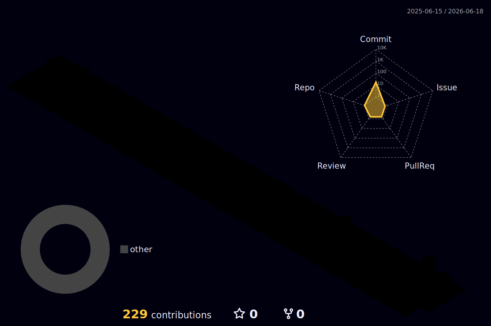

# nice to meet you.

### Quant Finance • Mathematics • Python • Data • Analytics

  Building toward financial engineering, quantitative research, and mathematical modeling.

---

## About me

- Interested in quantitative finance, mathematics, programming, and financial engineering.
- Currently building stronger foundations in Python, statistics, modeling, and analytics.
- I like dashboards, market models, clean visualizations, and elegant mathematical systems.
- Also into Japanese culture, anime, cars, music, and other very necessary side quests.

---

## 3D Contributions

  

---

## Languages

  
  
  
  
  
  
  
  
  
  
  
  
  

---

## Tools & libraries

  
  
  
  
  
  
  
  
  

---

## Operating systems

  
  
  

---

## Current interests

<table>
  <tr>
    <td><b>Quant Finance</b></td>
    <td>Portfolio theory, derivatives, risk models, stochastic processes, backtesting.</td>
  </tr>
  <tr>
    <td><b>Mathematics</b></td>
    <td>Probability, statistics, optimization, calculus, linear algebra, numerical methods.</td>
  </tr>
  <tr>
    <td><b>Programming</b></td>
    <td>Python, data analysis, dashboards, automation, model prototyping.</td>
  </tr>
  <tr>
    <td><b>Side quests</b></td>
    <td>Japanese culture, anime, cars, music, and beautiful technical setups.</td>
  </tr>
</table>

---

## Activity

  

---

### Mathematics is the language. Finance is one of its battlefields.

