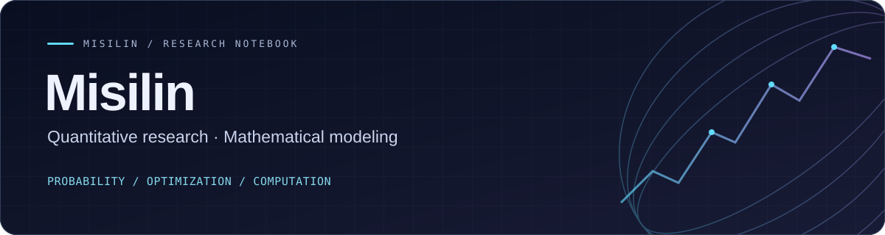
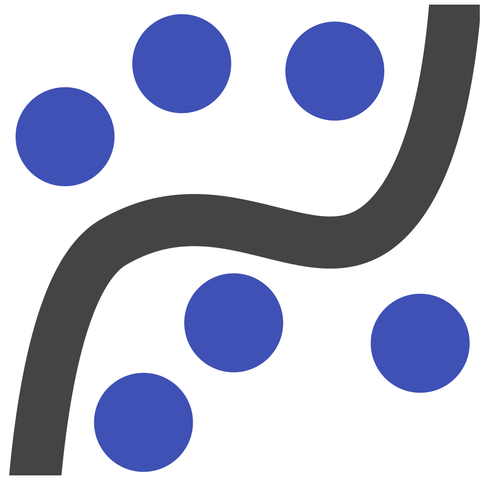
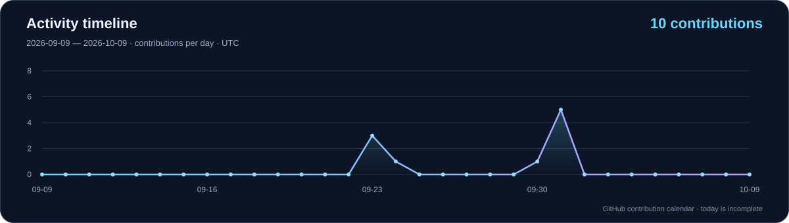
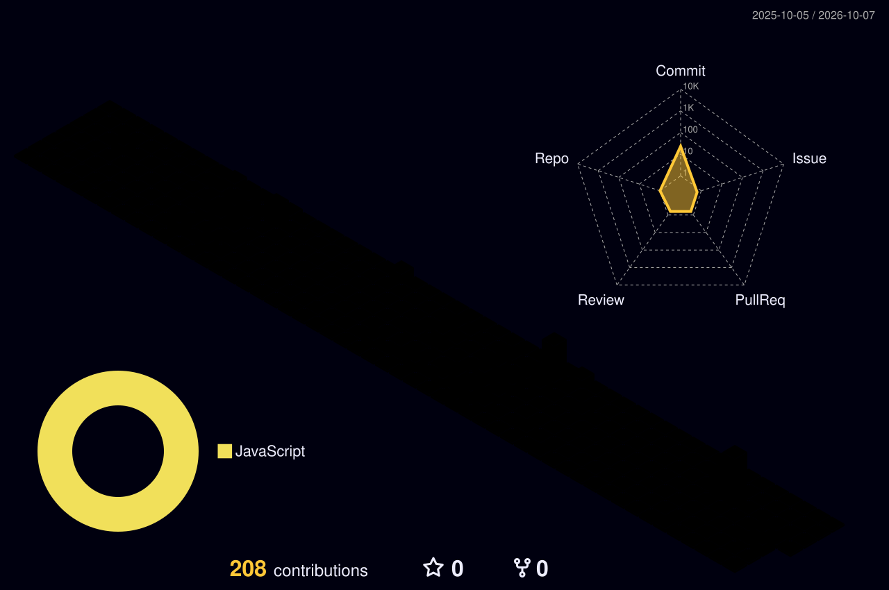

 

<b>From mathematical ideas to reproducible experiments.</b>

Economics &amp; finance background. Exploring quantitative finance through 
probability, optimization, statistical modeling, and scientific computing.

<a href="#languages">Languages</a> &nbsp;·&nbsp;
<a href="#research-stack">Research stack</a> &nbsp;·&nbsp;
<a href="#activity-timeline">Activity</a>

## Languages

<table>
  <tr>
    <td align="center" width="110">
       
      <b>Python</b>
    </td>
    <td align="center" width="110">
       
      <b>R</b>
    </td>
    <td align="center" width="110">
       
      <b>MATLAB</b>
    </td>
    <td align="center" width="110">
       
      <b>C++</b>
    </td>
  </tr>
</table>

## Research stack

<table>
  <tr>
    <td align="center" width="110">
       
      <b>NumPy</b>
    </td>
    <td align="center" width="110">
       
      <b>Pandas</b>
    </td>
    <td align="center" width="110">
       
      <b>SciPy</b>
    </td>
    <td align="center" width="110">
       
      <b>Statsmodels</b>
    </td>
  </tr>
  <tr>
    <td align="center" width="110">
       
      <b>Scikit-learn</b>
    </td>
    <td align="center" width="110">
       
      <b>Matplotlib</b>
    </td>
    <td align="center" width="110">
       
      <b>Plotly</b>
    </td>
    <td align="center" width="110">
       
      <b>Jupyter</b>
    </td>
  </tr>
</table>

## Workflow

<table>
  <tr>
    <td align="center" width="110">
       
      <b>JetBrains</b>
    </td>
    <td align="center" width="110">
       
      <b>PyCharm</b>
    </td>
    <td align="center" width="110">
       
      <b>DataSpell</b>
    </td>
    <td align="center" width="110">
       
      <b>Git</b>
    </td>
    <td align="center" width="110">
       
      <b>Windows</b>
    </td>
  </tr>
</table>

## Activity timeline

  

<b>Explore the contribution surface</b>

 

## Achievements

 

  

Mathematics · Markets · Code

